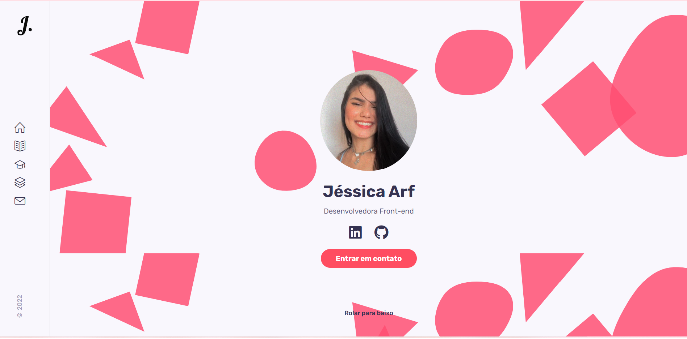

 <h1 align="center"><strong>Portfólio</strong></h1>

 

 
 Este projeto consiste na criação de um portfólio pessoal, onde utilizei o framework React e suas ferramentas para desenvolvê-lo.

 

 

## 	🛠️<strong> Conteúdo</strong>
<ul>
<li>Home</li>
<li>Sobre</li>
<li>Resumo</li>
<li>Contato</li>
</ul>
 

 ## 🖥 <strong>Tecnologias</strong>
 

 